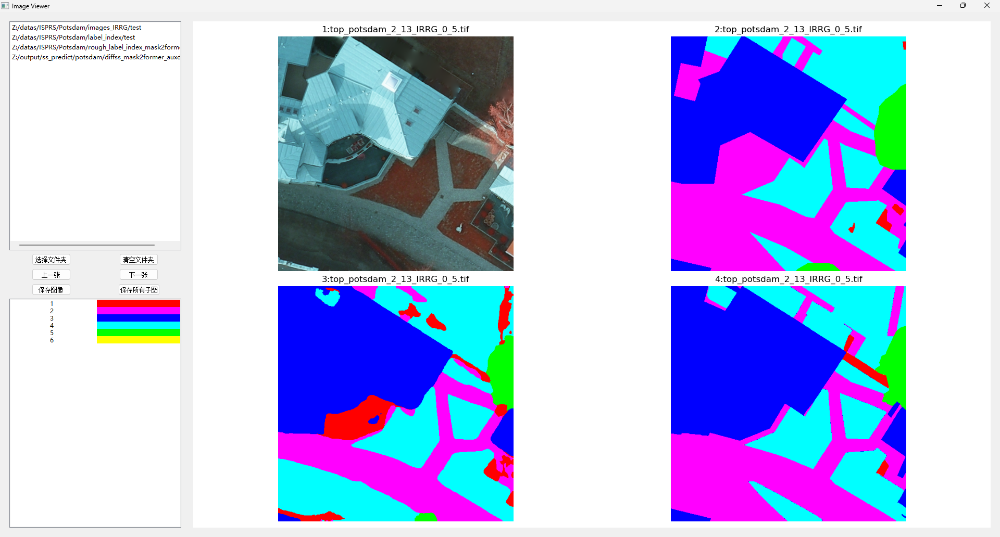

# 标签可视化工具（Labelshower）

## 项目介绍

在深度学习领域，尤其是计算机视觉中的语义分割任务中，对标签的准确理解和可视化至关重要。然而，直接查看灰度标签图往往不够直观，需要额外的处理才能将其转化为易于理解的颜色编码图像。本项目旨在解决这一痛点，提供了一个基于 PyQt5 和 Matplotlib 构建的简易标签快速可视化工具。通过这个工具，用户可以轻松地将灰度标签映射为预定义的颜色，并支持同时展示多个文件夹中的同名文件，从而极大地简化了语义分割结果的验证和分析过程。



## 主要特点

* **直观的颜色映射** ：将灰度标签快速转换为颜色编码的图像，便于理解和分析。
* **多文件夹同步展示** ：支持同时加载和展示多个文件夹中的同名文件，便于对比不同模型的预测结果或原始标签。
* **交互式界面** ：提供友好的用户界面，支持图像导航（上一张/下一张）、图像保存等功能。
* **灵活的颜色配置** ：允许用户自定义颜色列表，以适应不同的标签类别。

## 安装

确保你已经安装了以下 Python 库：

- PyQt5
- Matplotlib
- NumPy
- Pillow
- JSON

你可以使用 pip 来安装这些库：

```bash
pip install pyqt5 matplotlib numpy pillow
```

## 使用

1. 克隆此仓库到本地计算机。
2. 导航到项目目录。
3. 运行应用程序：

   ```
   python main.py
   ```

## 用户界面

应用程序的主要界面包括：

* **左侧边栏** ：
* 文件夹列表：显示所有加载的图像文件夹。
* 控制按钮：选择文件夹、清空文件夹、上一张/下一张、保存当前图像/所有子图。
* 颜色列表：显示当前的颜色列表，用于图像显示。
* **右侧图像显示区** ：
* 显示当前选中文件夹中的图像。
* 支持多图像子图显示。

## 操作指南

### 加载文件夹

* 点击“选择文件夹”按钮，选择包含图像的文件夹。
* 选定的文件夹将出现在左侧列表中。
* 允许通过鼠标拖拽添加文件夹。

### 浏览图像

* 使用“上一张”和“下一张”按钮在文件夹内导航图像。
* 可以通过拖动左侧列表中的文件夹来改变它们的顺序（bug）。

### 保存图像

* 点击“保存图像”按钮，保存当前显示的图像。
* 点击“保存所有子图”按钮，保存当前显示的所有子图。

### 自定义颜色列表

* 在左侧的“颜色列表”中查看当前的颜色列表。
* 可以通过编辑代码中的 `colorlist` 变量来自定义颜色。

## 注意事项

* 确保图像文件夹中只包含支持的图像格式（如 PNG, JPG, BMP 等）。
* 当前的图像显示逻辑可能需要根据具体的图像数据进行调整。

## 贡献

欢迎任何形式的贡献！如果你发现了 bug 或有新的功能建议，请提交 issue 或 pull request。

## 许可证

此项目使用 [MIT 许可证](https://tongyi.aliyun.com/qianwen/LICENSE)。
